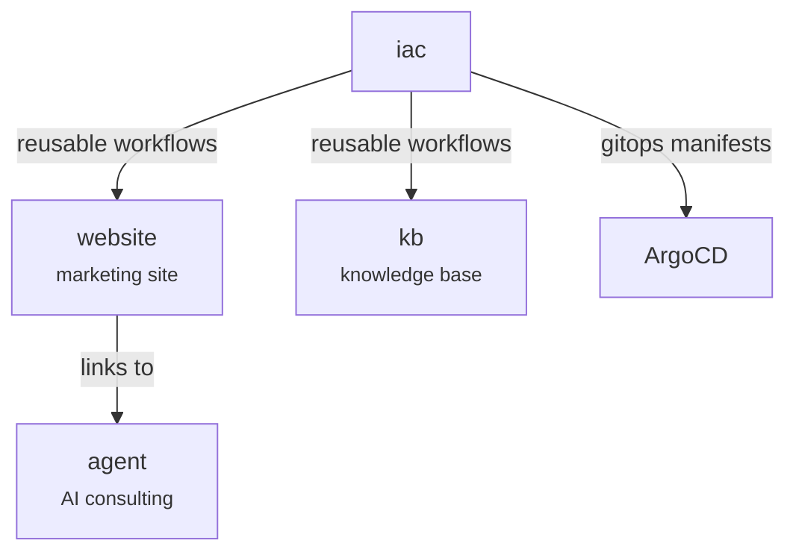
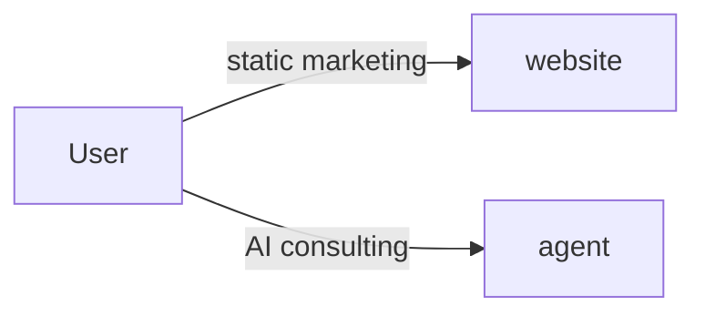
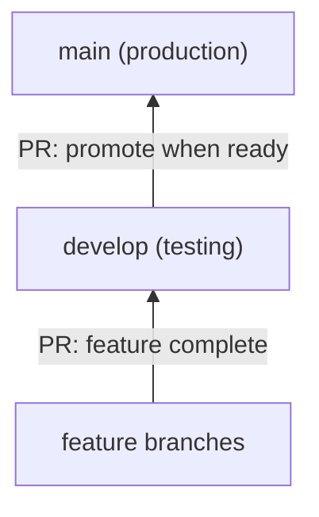
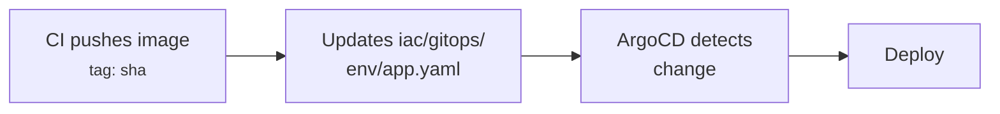
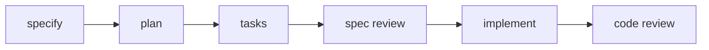

# im-u Organization Guide

This is the **org-level** CLAUDE.md for the im-u workspace. It defines cross-repo conventions, architecture, CI/CD pipelines, and the specification-driven development process.

**How this file works with repo-level files:**

- When working inside a repo (e.g., `website/`), Claude reads BOTH this file AND the repo's `CLAUDE.md`
- This file covers **cross-repo** concerns: architecture, GitFlow, CI/CD, spec-kit
- Repo-level CLAUDE.md files cover **repo-specific** concerns: tech stack details, local dev setup, internal architecture
- If a convention is defined here AND in a repo CLAUDE.md, the **repo-level file takes precedence** for that repo

**All documentation, comments, and commit messages MUST be in English.**

---

## Organization Map

### Repositories

| Repo | Stack | Purpose | Dev Command | Package Manager |
|------|-------|---------|-------------|-----------------|
| `website` | React 19, Vite 6, TypeScript, Three.js | Marketing website | `npm run dev` | NPM |
| `agent` | OpenClaw, Node.js | AI organizational consulting agent | N/A | NPM (global) |
| `kb` | MkDocs Material, Python 3.12 | Knowledge base | `poetry run mkdocs serve` | Poetry |
| `iac` | GitHub Actions YAML | Reusable CI/CD templates + GitOps | N/A | N/A |

### Repo Relationships



### Environments

| Branch | Environment | Purpose |
|--------|-------------|---------|
| `develop` | Testing | Integration testing, QA |
| `main` | Production | Live users |

---

## Cross-Repo Architecture


### Request Lifecycle



1. **Website**: Static marketing site at `imu.ai`. Links users to the agent.
2. **Agent**: OpenClaw-based AI organizational consulting agent.

### Database Ownership

| Database | Owner | ORM/ODM | Used By |
|----------|-------|---------|---------|
| Supabase (PostgreSQL) | website | Supabase client + SQL migrations | website (auth, projects, user data) |

---

## Unified GitFlow


**This branching strategy applies to ALL repos.**

### Branch Model



### Branch Naming

```
<type>/<scope>/<description>
```

**Types**: `feat`, `fix`, `refactor`, `docs`, `test`, `chore`, `ci`, `perf`
**Scope**: the module or area affected

Examples:

- `feat/api/add-notebook-endpoint`
- `fix/auth/session-refresh-loop`
- `refactor/pipeline/extract-gold-layer`
- `ci/website/add-pr-validation`

### Rules

1. **All changes go to `develop` first** via PR. Never push directly to `main`.
2. **Promote `develop` -> `main`** via PR when the testing environment is validated.
3. **Hotfixes**: Branch from `main`, merge to BOTH `main` and `develop`.
4. **Delete feature branches** after merge.

---

## Unified CI/CD Pipeline


### The Standard Pipeline

All deployable repos (website, agent, kb) MUST implement this pipeline:

| Event | Jobs | Artifact |
|-------|------|----------|
| PR to `develop` | Lint + Tests + Build (no push) | None |
| Merge to `develop` | Lint + Tests + Build + Push + GitOps update | Docker image tagged `<sha>` -> testing env |
| PR to `main` | Lint + Tests + Build (no push) | None |
| Merge to `main` | Lint + Tests + Build + Push + GitOps update | Docker image tagged `<sha>` -> production env |

**Important**: ALL image tags use the commit SHA (never `latest`). This enables deterministic deployments and rollback via ArgoCD.

### GitOps Deployment (ArgoCD)

After CI pushes a Docker image, it updates the image tag in the IAC repo's gitops manifests. ArgoCD watches these files and deploys automatically.

**Flow:**



**GitOps manifest location** (in IAC repo):

```
iac/
  gitops/
    testing/
      website.yaml
      openclaw-agent.yaml
      kb.yaml
    production/
      website.yaml
      openclaw-agent.yaml
      kb.yaml
```

Each file contains the image reference that ArgoCD reads:

```yaml
image:
  repository: docker.io/setchevest/im-u-website
  tag: "<sha>"
```

**How updates work (webhook pattern):**

1. Consumer repo CI calls `update-gitops-template.yml` (reusable workflow)
2. The template fires a `repository_dispatch` event (`update-image-tag`) to the IAC repo
3. IAC's `gitops-webhook.yml` receives the event, updates the file, and pushes using its own `GITHUB_TOKEN`
4. ArgoCD detects the commit and deploys

This decouples consumers from IAC's internal structure. The target IAC repo is configurable via the `iac_repo` input (defaults to `im-u-com/iac`). Concurrency is handled per app+environment to prevent conflicts.

**Required secret**: `IAC_REPO_TOKEN` - A GitHub PAT (or GitHub App token) with permission to trigger `repository_dispatch` on the IAC repo. `GITHUB_TOKEN` cannot be used here because it is scoped to the repo where the workflow runs.

### Conventional Commits Validation

**All repos** validate Conventional Commits on PRs via the `pr-validation-template.yml` reusable workflow.

Format:

```
<type>(<scope>): <description>

[optional body]

[optional footer(s)]
```

Types: `feat`, `fix`, `docs`, `style`, `refactor`, `perf`, `test`, `chore`, `ci`, `build`

Website and kb use IAC's `pr-validation-template.yml`.

### IAC Workflow Catalog

| Template | Purpose | Consumers |
|----------|---------|-----------|
| `build-push-generic-template.yml` | Build, scan (Trivy), push Docker image to any registry | website, kb |
| `pr-validation-template.yml` | Conventional Commits validation on PRs (comment + optional blocking) | website, kb |
| `update-gitops-template.yml` | Dispatch `update-image-tag` event to IAC repo (consumer-facing) | website, kb |
| `gitops-webhook.yml` | Receive dispatch event, update gitops manifests, push (IAC-internal) | IAC (self) |
| `webhook-notification.yml` | Notify webhook on CI failure | website, kb |
| `cleanup-dockerhub-template.yml` | Prune old Docker Hub image tags | website, kb |

### Required Secrets per Repo

| Secret | Purpose | Repos |
|--------|---------|-------|
| `IAC_REPO_TOKEN` | PAT to trigger `repository_dispatch` on IAC repo | website, kb |
| `DOCKERHUB_USERNAME` | Docker Hub registry username | website, kb |
| `DOCKERHUB_TOKEN` | Docker Hub registry password/token | website, kb |
| `NOTIFY_WEBHOOK_URL` | Webhook URL for CI failure alerts | website, kb |
| `SYNC_TOKEN` | GitHub PAT for spec-kit sync workflow | .github |

---

## Specification-Driven Development with spec-kit


### Overview

[Spec-kit](https://github.com/github/spec-kit) provides a structured workflow for defining features as specifications before implementation. Specs live **in the feature branch** and are reviewed before code is written (shift-left review).

**Integration scope**: All repos (website, agent, kb) + workspace root (cross-repo specs).

### Workflow



### Constitution (Inheritance Model)

The constitution uses an **inheritance model** with two files per repo:

- **`org-constitution.md`**: Org-wide principles (synced from `.github` repo via CI, read-only)
- **`constitution.md`**: Repo-specific principles (editable, extends org constitution)

The org constitution lives in the `.github` repo at `.specify/memory/constitution.md` and is the authoritative source. CI syncs it to all repos as `org-constitution.md`. Each repo adds its own conventions in `constitution.md`.

### When Specs ARE Required

- Database schema changes (Supabase migrations)
- New features requiring multiple acceptance scenarios
- Cross-repo features (anything touching multiple repos)

### When Specs Are NOT Required

- Bug fixes within a single repo
- UI-only changes using existing API endpoints
- Documentation updates
- Refactoring that doesn't change public interfaces
- Dependency updates

### Single-Repo Spec Pattern

For features within a single repo, specs live in the repo at `specs/###-feature-name/`. The `/speckit.specify` command creates the branch and spec directory automatically.

### Cross-Repo Spec Pattern

For features that span multiple repos:

1. **Spec lives at workspace root**: `specs/###-feature-name/`
2. **Tasks are tagged per repo**: `[WEBSITE]`, `[AGENT]`, `[KB]`

### Branch Naming

- Spec-required features: `###-feature-name` (created by `/speckit.specify`)
- Non-spec changes: `type/scope/description` (manual, GitFlow convention)

### Per-Repo Setup

Each repo that uses spec-kit has:

```
<repo>/
  .specify/
    memory/
      org-constitution.md   # Synced from .github repo (read-only)
      constitution.md       # Repo-specific principles
    templates/              # Spec, plan, tasks templates
    scripts/bash/           # Feature creation and setup scripts
  .claude/commands/
    speckit.*.md            # 9 spec-kit commands
  specs/                    # Feature specs (created per-feature)
```

### Agent Workflow

```bash
# 1. Define the feature (creates branch + spec)
/speckit.specify Add batch processing endpoint

# 2. Create the technical plan
/speckit.plan

# 3. Break into tasks
/speckit.tasks

# 4. Push + open draft PR for spec review (shift-left)

# 5. After spec approval, implement
/speckit.implement
```

### Spec-Kit CI Workflows

| Workflow | Trigger | Purpose |
|----------|---------|---------|
| `sync-speckit.yml` | Push to `main` (`.specify/**` or commands changed) | Propagates spec-kit files from `.github` to all repos via PRs |
| `update-speckit-upstream.yml` | Manual (`workflow_dispatch`) | Pulls new spec-kit version from [upstream](https://github.com/github/spec-kit) into `.github` repo |

**Upstream update flow**: Run `update-speckit-upstream.yml` with the desired version tag → review and merge the PR to `main` → `sync-speckit.yml` auto-propagates to all repos.

### Spec-Driven CI (Future Work)

Planned capabilities (not yet implemented):

- **Spec validation on PR**: Verify spec-required changes include a complete spec
- **AI agent execution** (`spec-agent-template.yml`): Automated spec review and validation

---

## Shared Conventions


### Language

ALL documentation, code comments, commit messages, PR descriptions, and specs MUST be written in **English**.

### Conventional Commits

Detailed format, types, scopes, and guidelines in `.claude/rules/commit-conventions.md` (auto-discovered).

Quick reference: `type(scope): description` — imperative mood, lowercase, no period, max 72 chars.

### Branch Naming

See the Unified GitFlow section above.

### DRY Principle

Detailed guidelines in `.claude/rules/dry-principle.md` (auto-discovered).

### Clean Code

Detailed guidelines in `.claude/rules/clean-code.md` (auto-discovered).

### Claude Code Configuration

Every repo MUST have these two files to ensure Claude Code automatically discovers and applies org-level rules:

**`.claude/settings.json`** — Shared permissions (committed to git, shared with team):

```json
{
  "permissions": {
    "allow": [
      "Read(.claude/rules/**)",
      "Read(../.github/.claude/rules/**)"
    ]
  }
}
```

This auto-allows Claude to read both repo-level rules and org-level rules without prompting.

> **Note**: This is different from `.claude/settings.local.json` which is personal, listed in `.gitignore`, and NOT committed.

**`.claude/rules/org-rules.md`** — References to org-level rules:

```markdown
@../../.github/.claude/rules/commit-conventions.md
@../../.github/.claude/rules/dry-principle.md
@../../.github/.claude/rules/clean-code.md
```

The `@` references cause Claude to load the org-level rule files when working inside the repo. Additional repo-specific rules live alongside this file in `.claude/rules/`.

### Code Quality Tools by Stack

**TypeScript repos** (website):

- Formatter: Prettier
- Linter: ESLint
- TypeScript: strict mode enabled
- Website: `npm run lint`

**Python repos** (kb):

- Build: `poetry run mkdocs build --strict`

---

## Documentation Standards

### Language

All documentation MUST be in English.

### Documentation Types and Locations

| Doc Type | Location | Format |
|----------|----------|--------|
| Feature specs | `.specify/specs/<feature>/` | spec-kit format (spec.md, plan.md, tasks.md) |
| Architecture Decision Records | `<repo>/docs/adrs/` | ADR format |
| Architecture docs | `<repo>/docs/architecture/` | Markdown (see `website/docs/architecture/auth-system.md`) |
| Repo setup & conventions | `<repo>/CLAUDE.md` | Markdown |
| Org conventions | `.github/CLAUDE.md` (this file, version-controlled in the `.github` repo) |

### ADR Format

ADR format:

- Numbered sequentially: `001-<title>.md`
- Sections: Status, Context, Decision, Consequences (Positive, Negative)

---

## Cross-Repo Coordination Playbooks


### 1. New IAC Workflow Template

```
1. Create template in iac/.github/workflows/<name>-template.yml
2. Use workflow_call trigger with documented inputs/secrets
3. Test with a consuming repo's CI (point to branch temporarily)
4. Merge to main in iac
5. Update consuming repos to reference the new template
6. Document in this file's IAC Workflow Catalog table
```

### 2. Internationalization Changes

| Repo | i18n Library | Translation Files |
|------|-------------|-------------------|
| website | i18next | `website/public/locales/{en,es,fr}/` |
| agent | N/A | Bilingual (ES/EN) via SOUL.md persona |

When adding a new translation key:

- Add to ALL language files (en, es, fr)
- Use the existing namespace structure
- Test with each locale

### 3. Database Schema Change

**Supabase (website)**:

```
1. Write spec with data model section
2. Create migration: supabase migration new <name>
3. Write SQL migration with RLS policies
4. Test locally: supabase db reset
5. Apply to testing: merge to develop
6. Apply to production: merge to main (manual step)
```

---

## Repo Quick Reference

Fast lookup for key entry points (details in each repo's CLAUDE.md):

| Repo | Main Entry | Config | Routes/Pages |
|------|-----------|--------|--------------|
| website | `src/index.tsx` | `src/vite.config.ts` | `src/pages/` |
| agent | `workspace/SOUL.md` | `Dockerfile` | N/A |
| kb | `docs/` | `mkdocs.yml` | `docs/` (content sections) |
| iac | N/A | N/A | `.github/workflows/` |
